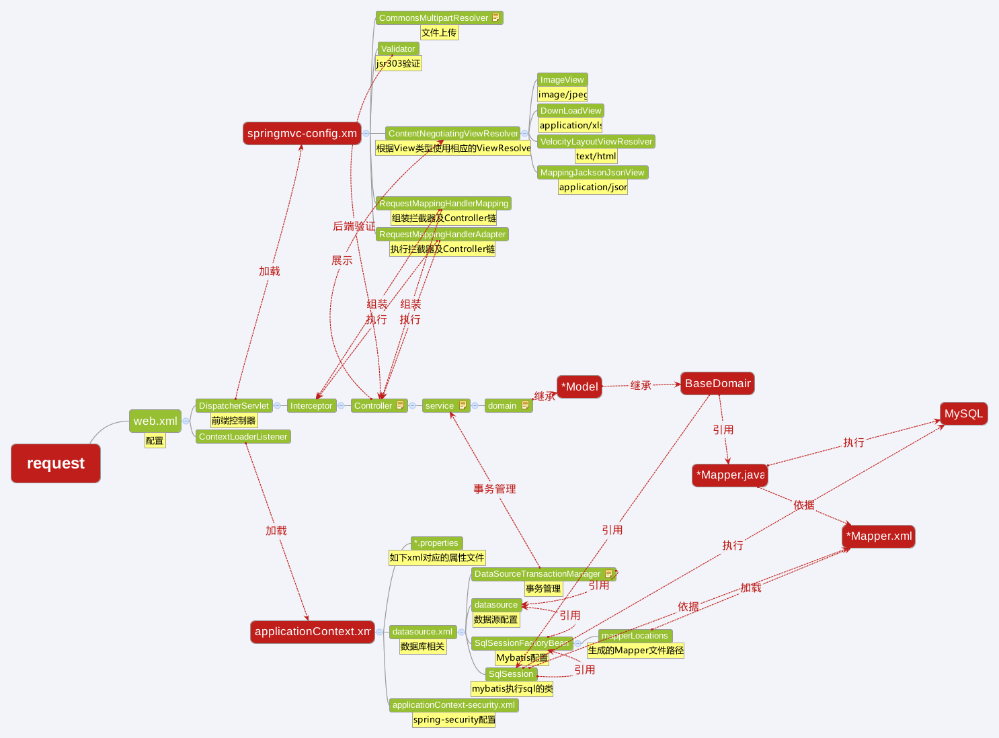

# pig-template
A Java Develop Template created with Spring,SpringMVC,MyBatis,Velocity

# 模块

- mybatis-gemerator:包含generatorConfig.xml配置文件，Mybatis Generator配置
- mybatis-generator-plugins:Mybatis Generator插件，生成项目需要的文件
- mybatis-model:自动生成的文件都在此模块中
- web-base:web应用通用模块
- webapp:web应用核心模块

# 各开源项目及版本

- Spring,SpringMVC:4.1.0.RELEASE
- SpringSecurity:4.0.0.RC1   注意：目前此版本不在Maven库中，请手动添加
- Velocity:1.7
- Mybatis:3.2.7

# 结构图

# 应用分层

- view:webapp/src/main/webapp/WEB-INF/velocity
- Controller
        - 包:com.webapp.controller
        - 注解:@Controller
- Service
        - 包:com.webapp.service
        - 注解:@Service,@Transactional
- Domain
        - 包:com.webapp.domain
        - 注解:@Configurable

# Mybatis代码生成

- 修改generatorConfig.xml中相关配置
- 在mybatis-generator项目上运行maven命令:
                mvn -Dmybatis.generator.overwrite=true mybatis-generator:generate

# 部署

- 执行init.sql
- 修改datasource.xml中数据库相关配置
- vm Options 添加如下内容: -javaagent:{path}/aspectjweaver-1.8.2.jar
